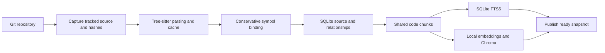

# RepoMap

**Find where a feature is implemented, inspect its definitions and references, and follow the code that connects it.**

RepoMap is a local, single-user code search and repository intelligence research MVP. It combines Tree-sitter syntax analysis with keyword and semantic retrieval. For questions such as “Where is authentication implemented?”, it retrieves relevant source code and can optionally send a bounded set of evidence to a Chat Completions-compatible LLM for a cited answer.

Search, indexing, embeddings, and storage run locally. LLM credentials are optional. Multiple repositories can be managed, but each query targets one repository and one published snapshot.

## Contents

- [Features and implementation status](#features-and-implementation-status)
- [Quick start](#quick-start)
- [Using the interface](#using-the-interface)
- [Command-line usage](#command-line-usage)
- [How indexing works](#how-indexing-works)
- [Search strategies](#search-strategies)
- [Definitions, references, and dependencies](#definitions-references-and-dependencies)
- [Configuration and optional answers](#configuration-and-optional-answers)
- [API reference](#api-reference)
- [Architecture and source guide](#architecture-and-source-guide)
- [Benchmark and reproduction](#benchmark-and-reproduction)
- [Development and verification](#development-and-verification)
- [Troubleshooting and limitations](#troubleshooting-and-limitations)

## Features and implementation status

The five MVP phases are implemented: repository acquisition, structural indexing, retrieval and evaluation, React exploration, and optional cited answers with a confirmed benchmark. Implementation does not imply complete semantic analysis or production readiness.

| Capability | Current behavior |
|---|---|
| Repository import | Public HTTPS GitHub imports pinned to a commit SHA; local Git root registration; duplicate imports reuse the catalog entry |
| Structural analysis | Python, JavaScript, JSX, TypeScript, and TSX symbols, scopes, imports, exports, references, and call sites |
| Other text files | Eligible UTF-8 text remains searchable without structural bindings |
| Indexing | Immutable source snapshots, parsing/embedding caches, persisted serial background tasks, failure recovery, and retention of two successful snapshots |
| Retrieval | Independently runnable `vector-only`, `bm25`, `hybrid`, and `ast-aware` strategies over shared chunks |
| Exploration | Snapshot source browsing, symbol and position lookup, reference confidence, and expandable one-hop dependency graphs |
| Optional answers | Evidence-first interface, bounded LLM context, citation validation, and search-only fallback |
| Evaluation | 60 human-confirmed labels; 45 held-out test queries; JSON, CSV, Markdown, and UI report tables |

[Verification evidence](docs/verification.md) records executed checks. [Confirmed benchmark analysis](benchmarks/results/confirmed/README.md) records measurements and their boundaries. A live cloud LLM provider remains unverified; local HTTP protocol and citation handling have been tested.

## Quick start

### Requirements

- Python 3.10 or newer, Git, and Node.js 22 or newer.
- A Python SQLite build with FTS5 enabled.
- Internet access for dependency installation, public GitHub imports, and the first embedding model download.
- CPU memory and disk space for the model, source snapshots, and vector indexes. Large repositories can take substantial time; see the indexing measurements below.

The verified development environment is Windows/PowerShell. Commands below use that environment. Start from a checkout of this repository.

### 1. Install and start the backend

Run from the repository root:

```powershell
python -m venv .venv
.\.venv\Scripts\python -m pip install -r requirements-lock.txt
.\.venv\Scripts\python -m pip install --no-build-isolation -e .
.\.venv\Scripts\python -m uvicorn repomap.api:create_app --factory --host 127.0.0.1 --port 8000
```

Leave this terminal running. Interactive API documentation is available at [localhost:8000/docs](http://127.0.0.1:8000/docs).

### 2. Install and start the frontend

In a second terminal, from the repository root:

```powershell
cd frontend
npm ci
npm run dev
```

Open the localhost URL printed by Vite, normally [localhost:5173](http://127.0.0.1:5173/). Vite proxies `/api` requests to the backend on port 8000. `npm run build` checks TypeScript and creates frontend assets; the backend does not automatically serve those built assets.

### 3. Import, index, and search

1. Select **Public GitHub** and enter a URL such as `https://github.com/pallets/flask.git`, or select **Local Git directory** and enter an absolute Git root path.
2. Import the repository, select it, and click **Index repository**. Import alone does not create searchable data.
3. Wait for the task to complete and select a published snapshot. The first index loads and, if necessary, downloads the embedding model.
4. Search for a symbol, keyword, or question. Switch strategies to compare the results.
5. Open a hit to inspect captured source, references, and graph neighbors.

Local repositories must have at least one commit. Paths refer to the backend machine. Only Git-tracked files are indexed: use `git add` for a new file that should be included, even if you do not commit it yet.

## Using the interface

The repository section shows import controls, active repository/snapshot selection, task progress, and index statistics with skipped-file reasons. The search section offers strategy, language, and path-prefix filters. Paths use repository-relative forward slashes, such as `src/auth/`.

Each hit includes its path, line range, symbol when available, score, and match origins. Click a hit to read the snapshot source. Definition/reference lookup accepts a 1-based line and a 0-based **UTF-8 byte column**; a byte column can differ from a displayed character column for non-ASCII text.

The dependency graph shows file or symbol neighbors. Select a repository-local node to request its next one-hop neighborhood. External modules are displayed but cannot be expanded into invented local definitions.

The question section displays retrieved evidence before optional answer generation. Evidence remains accessible if generation is disabled or fails. Citation buttons open the corresponding retrieved chunks. Evaluation tables load valid `results.json` files beneath the backend data directory's `reports/` folder.

## Command-line usage

Run from the repository root. Replace `REPOSITORY_ID` and `SNAPSHOT_ID` with the actual values returned by import and indexing.

```powershell
# Register a local Git root without modifying its working tree.
.\.venv\Scripts\python -m repomap.cli import local 'D:\projects\example'

# Or clone a public GitHub repository and record its exact commit.
.\.venv\Scripts\python -m repomap.cli import github 'https://github.com/pallets/flask.git'

# Build a searchable snapshot synchronously.
.\.venv\Scripts\python -m repomap.cli index REPOSITORY_ID

# Exclusions can be repeated; patterns match repository-relative paths.
.\.venv\Scripts\python -m repomap.cli index REPOSITORY_ID --exclude 'tests/*' --exclude 'docs/*'

.\.venv\Scripts\python -m repomap.cli search REPOSITORY_ID SNAPSHOT_ID 'Where is authentication implemented?' --strategy ast-aware --k 10
```

The CLI prints JSON and runs indexing synchronously. The HTTP API queues indexing in a serial background worker. CLI search exposes strategy and K; language/path filters are available through the API and interface.

`--data-dir` is a global CLI option and belongs **before** the subcommand:

```powershell
.\.venv\Scripts\python -m repomap.cli --data-dir .repomap/custom import local 'D:\projects\example'
```

Use the same data directory for import, indexing, search, and evaluation. The CLI defaults to `.repomap`; `REPOMAP_DATA_DIR` configures the API rather than replacing the CLI's explicit argument.

For a small authentication-flow demonstration using the real local model:

```powershell
.\.venv\Scripts\python scripts/create_demo.py
```

The script writes ignored local data. Its example credentials are demonstration literals, not production authentication.

## How indexing works



An index captures the actual content of tracked files, including local uncommitted changes, and records the Git HEAD plus content hashes. Queries read that captured source rather than the current working tree. Editing files after publication does not change existing search results; trigger indexing again to create a new snapshot.

Structural data is staged first. A snapshot becomes `ready` only after text and vector indexing complete. Queries reject unpublished, failed, retired, or foreign-repository snapshots. A failed build preserves previous successful snapshots. Successful publication retains the current and previous successful snapshots; older successful data is retired.

Parsing caches include the source hash, path, and parser version. Embedding caches include model identity, chunking version, and exact embedding input. Unchanged updates reuse expensive outputs but still build new snapshot-specific SQLite/FTS5 and Chroma storage; incremental indexing is not an in-place vector patch.

Functions and methods are primary chunks. Classes, interfaces, and namespaces contribute headers before their child definitions where present. Remaining module code, documentation, and syntax-error regions are also retained. Long chunks prefer AST statement boundaries; oversized statements must be split at token offsets. Text-only files use line-preferred windows. The default budget is 512 embedding tokens including path/symbol context, with 64-token overlap. MiniLM was trained with a shorter sequence limit, so this configuration is a model tradeoff rather than a claim of optimal quality.

The capture step excludes dependency/build directories, generated files, symlinks or paths outside the root, binary/non-UTF-8 files, and files larger than **1,000,000 bytes**. Additional exclusion patterns are supported through the API and CLI. Snapshot metrics record skipped paths and reasons.

API tasks progress through `queued`, `running`, and `completed` or `failed`. On restart, queued/running tasks are marked failed and can be retried by triggering a new index. Run one backend instance for this local serial-worker MVP.

## Search strategies

All strategies use the same repository snapshot, chunks, and filters. Scores are strategy-specific and should not be compared as calibrated probabilities.

| Strategy | How it ranks code |
|---|---|
| `vector-only` | Local normalized embeddings and cosine similarity through Chroma |
| `bm25` | SQLite FTS5 keyword matching over paths, symbols, and code/documentation, with snake_case and camelCase token splitting |
| `hybrid` | Top 100 candidates from each channel, combined with Reciprocal Rank Fusion: `1 / (60 + rank)` per channel |
| `ast-aware` | Hybrid plus exact symbol matches and one-hop expansion through resolved import, call, and containment edges |

AST-aware expands up to 20 seeds, adds at most 5 neighbor chunks per seed at half the original seed score, and deduplicates by keeping the highest score. It preserves match origins such as `bm25`, `vector`, `exact-symbol`, and `dependency-expansion`. It does not perform recursive graph expansion, LLM query rewriting, or reranking.

## Definitions, references, and dependencies

Tree-sitter provides syntax, not a complete type system. Binding follows lexical scopes and supported imports, including Python relative/module imports and TS/JS relative imports, `tsconfig` path mappings, and re-exports. Confidence is explicit:

| Status | Meaning |
|---|---|
| `resolved` | Supported binding rules identify exactly one definition |
| `candidate` | Multiple possible definitions remain; callers must preserve that ambiguity |
| `unresolved` | No definite local binding is established, including unsupported dynamic/member access |

Local variables and reassignments can block an outer symbol or imported name. Matching identifier text alone does not establish a relationship. External imports remain module edges rather than repository-local symbols. Syntax diagnostics are recorded; unsafe error regions remain text-searchable and do not create definite bindings.

## Configuration and optional answers

Set variables in the backend shell before startup. [`.env.example`](.env.example) lists the names; **dotenv files are not loaded automatically**.

| Variable | Behavior |
|---|---|
| `REPOMAP_DATA_DIR` | API storage directory; default `.repomap` relative to the startup directory |
| `REPOMAP_EMBEDDING_MODEL` | Model identifier; default `sentence-transformers/all-MiniLM-L6-v2` |
| `REPOMAP_EMBEDDING_REVISION` | Optional immutable model revision; the resolved revision is recorded in snapshot fingerprints |
| `REPOMAP_CPU_THREADS` | Embedding/Chroma CPU worker setting; default `4` |
| `REPOMAP_LLM_BASE_URL` | Optional service base URL, including a version prefix when needed |
| `REPOMAP_LLM_MODEL` | Optional service model identifier; both base URL and model are required to enable generation |
| `REPOMAP_LLM_API_KEY` | Optional bearer credential; omitted when empty for local services that require no key |

Changing the embedding model or fingerprint requires reindexing, or restoring the model configuration used by the selected snapshot. The confirmed benchmark used revision `1110a243fdf4706b3f48f1d95db1a4f5529b4d41`.

Optional generation calls the configured base URL plus `/chat/completions`. It always retrieves `ast-aware` evidence, even if a request supplies another strategy or K. It sends at most 20 chunks within an approximate 6,000-token prompt budget, expects a JSON answer with chunk-ID citations, and checks that inline/listed citations agree and refer to supplied evidence. Citation validation checks evidence identities; it does not prove that every generated claim is correct.

Without configuration, the response has status `disabled` and retains retrieval results. Empty or unusable evidence produces `insufficient-evidence`; request/format failures return `unavailable` with evidence preserved. LLM latency is measured separately.

Source sent to an optional remote service leaves the local machine. Configure that service only when this is appropriate for the repository. Keep credentials, databases, imported repositories, vectors, and model caches out of Git.

## API reference

All public routes use `/api/v1`. Use [Swagger UI](http://127.0.0.1:8000/docs) for exact request schemas while the backend is running.

| Method | Route | Purpose |
|---|---|---|
| GET | `/health` | Basic service health |
| GET / POST | `/repositories` | List or import repositories; POST takes `kind` and `source` |
| POST | `/repositories/{repository_id}/index` | Queue indexing; body takes an optional `exclusions` list; returns HTTP 202 |
| GET | `/tasks/{task_id}` | Poll persisted task status/progress/error |
| GET | `/repositories/{repository_id}/snapshots` | List snapshot identities, statuses, and metrics |
| POST | `/search` | Retrieve ranked chunks |
| GET | `/files` | Read a captured file or line range |
| GET | `/symbols` | List symbols, optionally by path |
| GET | `/definitions` | Resolve a symbol ID or file position |
| GET | `/references` | Return definition context and matching references with confidence |
| GET | `/graph` | Get one-hop file/symbol neighbors; default limit 100, maximum 500 |
| POST | `/answers` | Retrieve evidence and optionally generate a cited answer |
| GET | `/reports` | List validated local evaluation summaries |

Search JSON uses `repository_id`, `snapshot_id`, `query`, `strategy`, `k` (1–100), and optional `language`/`path_prefix`. Language values produced by indexing are `python`, `javascript` (including JSX), `typescript`, `tsx`, and `text`.

```json
{
  "repository_id": "REPOSITORY_ID",
  "snapshot_id": "SNAPSHOT_ID",
  "query": "Where is authentication implemented?",
  "strategy": "hybrid",
  "k": 10,
  "language": "python",
  "path_prefix": "src/"
}
```

Results carry snapshot identity, chunk `id`, `path`, `start_line`, `end_line`, `symbol`, `excerpt`, `score`, and `origins`. Exploration requests also require repository and snapshot IDs. File requests take a repository-relative `path` and optional inclusive line range. Definition/reference requests take `symbol_id` or `path`, `line`, and `column`. Graph requests take `path` or `symbol_id`. File reads use captured storage and reject path traversal.

## Architecture and source guide

| Layer / file | Responsibility |
|---|---|
| `src/repomap/repositories.py` | Git acquisition, commit pinning, SQLite repository catalog |
| `src/repomap/parsing.py` | Tree-sitter syntax extraction and source positions |
| `src/repomap/binding.py` | Conservative lexical/import resolution and relationship confidence |
| `src/repomap/indexing.py` | Source capture, snapshot lifecycle, cache reuse, serial task coordination |
| `src/repomap/vectors.py` | Statement-aware chunks, model fingerprints, FTS5, embedding cache, Chroma |
| `src/repomap/retrieval.py` | Four retrieval strategies and explainable ranking |
| `src/repomap/exploration.py` | Snapshot source, definition/reference queries, dependency neighbors |
| `src/repomap/answers.py` | Bounded evidence and optional cited generation |
| `src/repomap/evaluation.py` | Annotation validation, quality/latency measurements, exports |
| `src/repomap/reports.py` | Validated, compact report data for the UI |
| `src/repomap/api.py` / `cli.py` | HTTP and command-line entry points |
| `frontend/src/` | React repository/task controls, source explorer, answers, and reports |
| `scripts/` | Demo creation and fixed benchmark preparation |
| `tests/` | Parsing, binding, snapshots, retrieval, APIs, and evaluation checks |
| `benchmarks/` | Pinned repository specification, reviewed annotations, and confirmed artifacts |

SQLite (`catalog.sqlite3`) is the source of truth for catalog, snapshots, captured files, symbols, references, edges, chunks, caches, and task state. Chroma persists under the selected data directory's `vectors/` folder, with a separate collection per snapshot and chunk IDs matching SQLite. Public GitHub checkouts are stored under that data directory; local imports reference existing Git roots. The frontend accesses all data through APIs.

## Benchmark and reproduction

The fixed protocol uses Flask, Express, and TypeScript, with 20 human-confirmed English queries each. Five per repository form the development split; the other 15 form the held-out test split. Tune only on development queries. Exact commit SHAs, exclusions, and source-range labels are retained in [benchmark documentation](benchmarks/README.md), `specification.py`, and `annotations.json`.

The completed test comparison contains 45 queries and 180 query/strategy rows, with three warm retrieval repeats per row:

| Strategy | Recall@5 | Recall@10 | Recall@20 | MRR@10 | p50 ms | p95 ms |
|---|---:|---:|---:|---:|---:|---:|
| vector-only | 0.4648 | 0.6130 | 0.7000 | 0.5348 | 25.37 | 521.66 |
| bm25 | 0.4185 | 0.5000 | 0.5630 | 0.4316 | 17.78 | 537.51 |
| hybrid | 0.5426 | 0.6167 | 0.6667 | 0.5455 | 29.91 | 606.26 |
| ast-aware | 0.5352 | 0.6167 | 0.6667 | 0.4918 | 43.39 | 1289.71 |

Hybrid leads Recall@5 and MRR@10; vector-only leads Recall@20. AST-aware does not lead this run. These measurements describe the fixed corpus, not a universal winner. Relevant chunks are defined by overlap with annotated source ranges; Recall@K is the fraction of relevant chunks retrieved, and MRR@10 uses the rank of the first relevant hit.

TypeScript's 360 eligible files produced 26,713 chunks. Full indexing took approximately 34.5 minutes; an unchanged incremental run took 13.3 minutes despite cache reuse because snapshot storage is rebuilt. The checker exceeds the file-size cap and is excluded. Full measurements, hardware, model identities, and timing limitations are in [confirmed analysis](benchmarks/results/confirmed/README.md), with [JSON](benchmarks/results/confirmed/results.json), [CSV](benchmarks/results/confirmed/results.csv), and a [generated report](benchmarks/results/confirmed/report.md).

To reproduce, first clone the three repositories into the locations and detached commits specified in [benchmarks/README.md](benchmarks/README.md), then run:

```powershell
.\.venv\Scripts\python scripts/prepare_benchmark.py --annotations-only
.\.venv\Scripts\python scripts/prepare_benchmark.py --data-dir .repomap/benchmark-current
```

The script preserves reviewed annotations, prepares full/unchanged incremental snapshots, writes `benchmark-runtime.json`, evaluates the test split, and exports results. A new data directory gives cold parsing/embedding caches; an already-downloaded model is a separate cache condition. Reproduction writes report artifacts, so review the resulting Git diff before committing measurements.

For an existing runtime dataset that contains repository/snapshot IDs in the selected data directory:

```powershell
.\.venv\Scripts\python -m repomap.cli --data-dir .repomap/benchmark-current evaluate .repomap/benchmark-current/benchmark-runtime.json --output .repomap/reports/reproduction --split test
```

Final evaluation rejects unconfirmed labels. `--allow-draft` produces explicitly provisional results. Reports include Recall@5/10/20, MRR@10, retrieval p50/p95, first-query latency, indexing time, sampled peak RSS, disk usage, dependencies, model, and hardware. First-query measurement is not process-cold latency. LLM generation is excluded. Put output beneath the running API's data directory `reports/` to display it in the interface.

## Development and verification

Backend tests, from the root:

```powershell
.\.venv\Scripts\python -m pytest -q
```

Most tests use deterministic encoder doubles to verify contracts without downloading a model. After the model is available, enable the real-model integration test:

```powershell
$env:REPOMAP_TEST_LOCAL_MODEL = '1'
.\.venv\Scripts\python -m pytest -q tests/test_local_model.py
```

Frontend verification, from `frontend`:

```powershell
npm run build
```

The prior complete verification ran 49 tests including the opt-in real-model test and passed the production frontend build. Browser checks exercised indexing, all-strategy search, source/reference/graph exploration, no-key answer fallback, and report display. See [verification.md](docs/verification.md) for actual evidence and remaining unverified areas.

Follow [AGENTS.md](AGENTS.md) for project constraints. Add meaningful tests for behavior changes, especially source ranges, nested scopes, aliases/re-exports, ambiguity, syntax-error fallback, file changes, cache reuse, failure recovery, and snapshot isolation. Core dependencies and frontend dependencies are pinned in `requirements-lock.txt`, `pyproject.toml`, and `frontend/package-lock.json`. Documentation must distinguish implementation, verification, and planned work.

### Continuous integration

[GitHub Actions](.github/workflows/ci.yml) runs backend tests on Python 3.10 and the frontend TypeScript/production build on Node.js 22 for pushes and pull requests. It installs locked dependencies, checks Python dependency consistency, and uses read-only repository permissions.

Normal CI runs skip the opt-in real-model test and use deterministic test encoders. A manual workflow run can enable `real_model` to download the pinned MiniLM revision and run that integration test. LLM credentials and the full benchmark are not required for CI. Hosted-runner results appear in the repository's Actions tab; local verification is separate from a successful hosted run.

## Troubleshooting and limitations

| Symptom | What to check |
|---|---|
| Repository imported but no search results | Trigger indexing and select a `ready` snapshot |
| New file is missing | Ensure it is Git-tracked, eligible, and not excluded; inspect skipped reasons |
| Source changes are absent | Index again; published snapshots deliberately retain captured content |
| Model download/load fails | Check connectivity, available memory, and model/revision settings; first-time setup needs model access |
| Embedding model mismatch | Restore the snapshot's model fingerprint configuration or build a new index |
| Snapshot unavailable | Check repository identity and snapshot status; only the two retained successful snapshots remain searchable |
| Task failed after restart | Inspect its error and trigger a new index; previous successful snapshots remain available |
| UI cannot reach the backend | Start the API on port 8000 and check the Vite development proxy |
| Definition remains unresolved | Dynamic calls, ambiguous members, and unsupported import/type behavior are intentionally conservative |
| `tsconfig` mappings are missing | The current loader accepts JSON compiler options; comments or other unsupported syntax are recorded as `unsupported-config-syntax` |
| Answer generation is disabled | Set both LLM base URL and model in the backend shell; search remains available |
| Evaluation table is empty | Ensure valid `results.json` output is under the API data directory's `reports/` folder |

GitHub cloning is synchronous with a 120-second Git-operation timeout; failed clone directories may remain in ignored local storage without a catalog entry. Imports do not automatically fetch later upstream commits. Local registration leaves the working tree unchanged and records HEAD; subsequent snapshots capture their own HEAD/content identity.

The MVP excludes private GitHub repositories, multi-user authorization, cross-repository search, live file watching, complete type inference, external task queues, additional vector backends, and LLM rerankers/query rewriting. There is no application authentication: use the documented localhost bindings. Large-repository indexing and retrieval remain research measurements rather than production performance guarantees.

## License

RepoMap is licensed under the [MIT License](LICENSE). Third-party dependencies, embedding models, and indexed repositories retain their own licenses.
